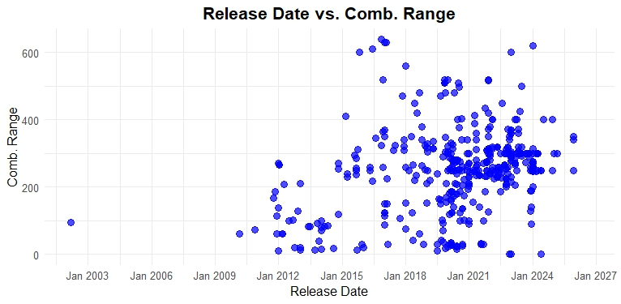

```{r setup, include=FALSE}
knitr::opts_chunk$set(echo = FALSE, message = FALSE, warning = FALSE)
```


```{css}
body {
  background-color: aliceblue;
}

#Title {
  background-color: white;
  border-radius: 5px;
  margin: 15px;
  padding: 10px;
}
#Introduction {
  background-color: white;
  border-radius: 5px;
  margin: 15px;
  padding: 10px;
}
#Graphs {
  background-color: white;
  border-radius: 5px;
  margin: 15px;
  padding: 10px;
}
#Graphs {
  background-color: white;
  border-radius: 5px;
  margin: 15px;
  padding: 10px;
}
#combinations {
  background-color: white;
  border-radius: 5px;
  margin: 15px;
  padding: 10px;
}
#branch-lengths {
  background-color: white;
  border-radius: 5px;
  margin: 15px;
  padding: 10px;
}
#experimental-results {
  background-color: white;
  border-radius: 5px;
  margin: 15px;
  padding: 10px;
}
#all-visualizations-together {
  background-color: white;
  border-radius: 5px;
  margin: 15px;
  padding: 10px;
}

```


## [Resume Link](https://JStubbsUVU.github.io/Media/Josh_Stubbs_Resume.pdf) | [Final Project]()

----

## **Electric Vehicles**
**Joshua Stubbs final project analysis of electric vehicles**

## **Introduction**

**The goal of this project is to analyze and obtain a better understanding of electric vehicles. There are many concerns and questions asked about electric vehicles like what their range is or what the cost to charge them is. The data set for this project was found on an electric vehicle form where people can collectively update and add information about existing and new electric vehicles. **


## **Date and Range**

```{r}

```

**This plot shows the release date and the combine range. It helps to show that electric vehicles range have increased overtime. It also shows that there were not many electric vehicles being produced prior to 2015.**

```{r}
# Load in libraries
library(ape)
library(phangorn)
library(ggplot2)
library(tidyverse)
library(kableExtra)
library(plotly)
library(patchwork)
library(dplyr)
library(tidyr)
library(gridExtra)
theme_set(theme_minimal())
```


## **Battery Kilowatt & Range**


```{r}

```


```{r}
knitr::include_graphics("./Media/Comparison of batt kWh & EVR.png")
```

**These two plots both show a comparison of battery kilowatt and the electric vehicle range in miles. These help show a trend of increasing range with the kilowatt density of batteries. It can also be observed that it is currently hard to obtain a range of over 400 miles. This is likely due to battery weight and the current power output per kilowatt.**

## **Model Plot**


```{r}
knitr::include_graphics("./Media/comparison of Batt and EVR wide.png")
```

**This plot is a model comparison of battery kilowatt and range in miles. Looking at the electric vehicles over the years, some of the first vehicles were made with Lead-acid batteries. These early batteries were heavy and had limited energy storage capacity. These batteries were heavy and only useful for short distance travel 100 miles or less. In recent years, lithium ion batteries have become popular for their light weight higher density energy storage. This plot shows the changes every 3 years and it is important to study the range in this way because the technology is changing rapidly and different battery chemistry can drastically skew results in the overall data.**

## **Model Table**

```{r,}

```

**This model data output shows that currently the average amount of miles per kilowatt is 3.71 miles. This means that an 85 kilowatt hour electric vehicle would most likely go 315 miles.**

## **Calculations**


```{r, echo=FALSE, out.width='50%', fig.align='center'}
knitr::include_graphics("./Media/Electric Vehicle formula.png")

```


**This is the formula to calculate the cost to charge an electric vehicle. With the average cost per kilowatt, it is simple to use the prior formula and calculate cost to charge. Multiplying the battery kilowatt to the average cost per kilowatt gives you cost to charge. For example a long range Tesla Model 3 has a 75 kWh battery capacity. With the provided formula, the cost to charge would be 11.88.**


## **Conclusion**

**Electric vehicles have slowly improved over time. The last 5 years have shown a large increase in range and a decrease in battery cost. Electric vehicles are still higher in price compared to their internal combustion engine counterparts. After looking over the range and cost of electric vehicles, the majority of Americans are not able to afford them. Costs of hybrids and plug in hybrids are dropping and seem to be the current affordable and efficient option.**


## **Fun Facts**

```{r,}

```

*This is the pre production Jaguar I-pace that will first be launched in Europe.* 


```{r,}

```
The current longest range vehicle in the United States is the Lucid Air. On a fast charger, it will charge to 200 miles in 12 minutes. This vehicle has a trim that has a max power of 1,234 hp and a 0-60 time of 1.89 seconds. The longest range option is currently 115,600 dollars.


```{r echo=FALSE}

#<iframe src="./Desktop/JStubbsUVU.github.io/Media/Josh_Stubbs_Resume.pdf" width="100%" height="500px"></iframe>


#[Resume Link]("./Desktop/JStubbsUVU.github.io/Media/Josh_Stubbs_Resume.pdf")

#[file:///C:/Users/Joshua/Downloads/Josh%20Stubbs%20Resume.pdf](Josh Stubbs Resume.pdf)


```


